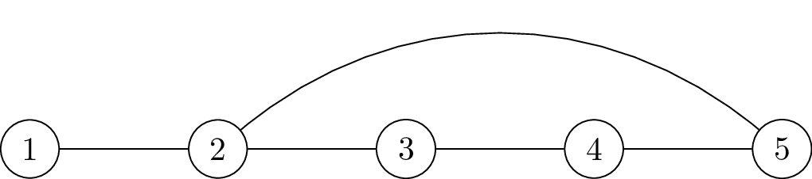
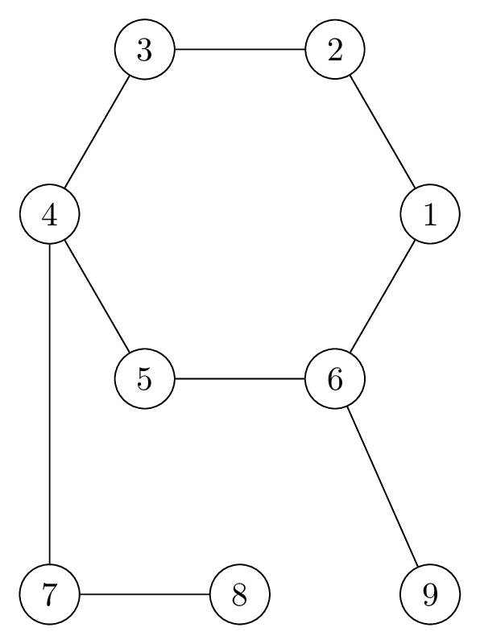

# Second Shortest Path in Pseudotree

## 問題文

$N$ 頂点 $N$ 辺の単純連結無向グラフ $G$ が与えられます。

頂点には $1, 2, \dots, N$ の番号が、辺には $1, 2, \dots, N$ の番号が付けられており、辺 $i$ は頂点 $u_i, v_i$ を結んでいます。

$1$ 以上 $N$ 以下の整数 $A, B$ が与えられます。 $G$ において、頂点 $A$ から頂点 $B$ へのパスのうち、 $2$ 番目に短いパスの長さを求めてください。ただし、そのようなパスが存在しない場合はその旨を報告してください。

ここで、同じ長さのパスが複数存在する場合、それらは互いに区別されます。

## 制約

### Hard

- $3 \le N \le 2 \times 10^5$
- $1 \le A, B \le N$
- $A \ne B$
- $1 \le u_i, v_i \le N$
- $G$ は単純かつ連結
- 入力はすべて整数

### Easy

- Hard の制約に以下の制約を追加
- $A = N$
- $1 \le B \le N - 1$
- $1 \le i \le N - 1 \Rightarrow u_i = i, v_i = i + 1$
- $u_N = N, v_N = k \quad (1 \le k \le N - 2)$

## 入力

入力は以下の形式で標準入力から与えられます。

<div class="code-math">

$N \ \ A \ \ B$ \
$u_1 \ \ v_1$ \
$\ \vdots \ \ \ \ \ \vdots$ \
$u_N \ \ v_N$

</div>

## 出力

頂点 $A$ から頂点 $B$ へのパスのうち、 $2$ 番目に短いパスの長さを $1$ 行に出力してください。

そのようなパスが存在しない場合、代わりに `-1` を出力してください。

## 入力例1
```
5 5 2
1 2
2 3
3 4
4 5
5 2
```

## 出力例1
```
3
```

$G$ は次のようになります。

<center>

</center>

頂点 $5$ から頂点 $2$ へのパスは次の $2$ つが存在します。

- 頂点 $5 \rightarrow$ 頂点 $2$
- 頂点 $5 \rightarrow$ 頂点 $4 \rightarrow$ 頂点 $3 \rightarrow$ 頂点 $2$

よって、 $2$ 番目に短いパスの長さは $3$ なので、 $3$ を出力してください。

この入出力例は Easy・Hard の制約を満たします。

## 入力例2
```
5 5 3
1 2
2 3
3 4
4 5
5 2
```

## 出力例2
```
2
```

$G$ は入出力例1と同一です。

頂点 $5$ から頂点 $3$ へのパスは次の $2$ つが存在します。

- 頂点 $5 \rightarrow$ 頂点 $2 \rightarrow$ 頂点 $3$
- 頂点 $5 \rightarrow$ 頂点 $4 \rightarrow$ 頂点 $3$

よって、 $2$ 番目に短いパスの長さは $2$ なので、 $2$ を出力してください。

長さ $2$ のパスが $2$ つありますが、これらは区別されることに注意してください。

この入出力例は Easy・Hard の制約を満たします。

## 入力例3
```
9 8 9
1 2
2 3
3 4
4 5
5 6
6 1
4 7
7 8
6 9
```

## 出力例3
```
7
```

$G$ は次のようになります。

<center>

</center>

この入出力例は Hard の制約を満たします。